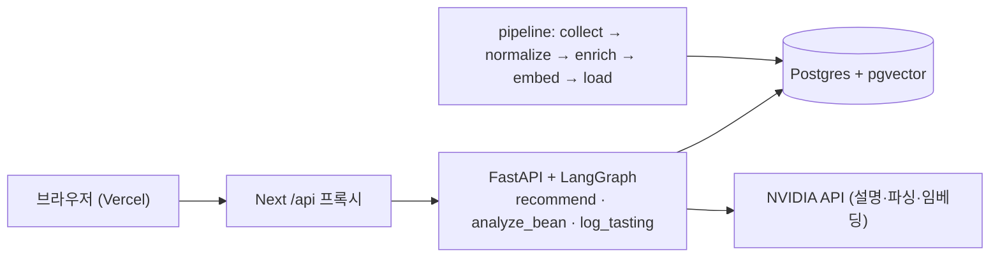

# ☕ Coffee Sommelier — 내 커피 취향을 알아주는 앱

> 건강 때문에 디카페인을 마시지만 산미 있는 커피를 좋아하는 사람도, 카페에서 실패 없이 고를 수 있게.

카페에서 음료를 고를 때 **사용자 조건(카페인 등)은 반드시 지키고**, 취향(산미·바디·향미)에 맞는 선택지를 **근거와 함께** 추천하며, 마신 기록으로 점점 개인화되는 앱을 만든다. **라이브 데모: https://coffee-sommelier-psi.vercel.app** (무료 서버라 첫 접속은 30초쯤 깨우는 시간이 걸릴 수 있다)

- 공모전 제출용 오픈 데이터판(coffeereview 미포함): https://coffee-sommelier-open.vercel.app
- API(FastAPI, `/docs`): https://coffee-sommelier-api.onrender.com


## 결과 한눈에

모든 수치는 `data/eval/*.json`(운영 스모크만 ADR)에서 옮겼고, `scripts/check_readme_numbers.py`가 README와 JSON을 대조한다. 자세한 해석은 아래 [평가 상세](#평가-상세)와 [설계 결정](docs/design-decisions.md).

| 무엇을 쟀나 | 결과 | 원자료 |
|---|---|---|
| 조건 위반율 (페르소나 4 × 브랜드 10, top3) | **0.0% — 0/102건** (메뉴 실측 7개 브랜드) | [phase2_violations.json](data/eval/phase2_violations.json) |
| 지식베이스 원두 수 | 9,155 (디카페인 168, 향미 태그 7,534) · 오픈 라이선스판 1,655 | [phase2_coverage.json](data/eval/phase2_coverage.json) |
| 원두 예측 leave-one-out, 산미 ±1 이내 | **0.735 (n=200)** · 오픈 라이선스판 0.5202 (n=198) | [phase2_loo.json](data/eval/phase2_loo.json) |
| 원두 예측 leave-one-out, 바디 ±1 이내 | 0.64 (n=200) · 오픈 라이선스판 0.6061 (n=198) | [phase2_loo.json](data/eval/phase2_loo.json) |
| 예측 신뢰도별 산미 ±1 (낮음 / 보통 / 높음) | 0.4 (n=10) / 0.7077 (n=130) / 0.85 (n=60) | [phase2_loo.json](data/eval/phase2_loo.json) |
| LOO 향미 태그 F1 (마이크로) | 0.4082 (n=168) — 가장 약한 지표 | [phase2_loo.json](data/eval/phase2_loo.json) |
| 3-way 비교: 전체 / 오픈 / 오픈 + 국내 로스터리 (CQI 고정 200개) | 산미 ±1 0.495 / 0.495 / 0.495 · 디카페인 원두 168 / 6 / 13 | [phase2_compare3.json](data/eval/phase2_compare3.json) |
| LOO 재현성 (같은 인자로 2회) | 결과 JSON sha256 동일 (`identical: true`) | [phase2_loo_repro.json](data/eval/phase2_loo_repro.json) |
| 설명 품질 (24케이스) | 규칙 통과 21/24 · 모순 없음 판정자 2명 합의 17/22 · 폴백 0/24 | [phase2_explain_quality.json](data/eval/phase2_explain_quality.json) |
| 설명 3개 순차 vs 병렬 (지연) | 4.59초 → 2.03초 · 설명 첫 토큰 p50 0.77초 / p95 1.37초 (설명 품질 24건) | [phase2_bench.json](data/eval/phase2_bench.json), [phase2_explain_quality.json](data/eval/phase2_explain_quality.json) |
| 학습 수렴: 모의 사용자 200명 × 10회 기록 후 프로필 오차 | 0.7792 → 0.7117 | [phase2_convergence.json](data/eval/phase2_convergence.json) |
| 운영 통계 (Render 로그 24시간 집계) | 집계 구간 요청 0건 — 아직 수치 없음. 수동 스모크: 카드 18장 중 폴백 2 ([ADR 0004](docs/adr/0004-explain-thinking.md)) | [prod_stats_2026-09-26.json](data/eval/prod_stats_2026-09-26.json) |

## 아키텍처



다이어그램 2장(데이터 파이프라인, 요청 흐름과 SSE 이벤트 순서)과 노드별 설명은 [docs/architecture.md](docs/architecture.md), LangGraph 자동 생성 다이어그램은 [docs/graphs.md](docs/graphs.md).

```
pipeline/
  collect/    robots.txt 준수 + 호스트별 1초 지연, 소스별 격리(하나가 실패해도 계속), 날짜별 원본 스냅샷
  normalize/  공통 스키마, 산지·가공·로스팅 표기 통일, 디카페인 판별, 3개 스크랩 데이터 병합
  enrich.py   규칙 우선 → 빈 칸만 로컬 LLM(qwen3.5:9b) → JSON 스키마 검증 → 재개 가능한 캐시
  embed.py    nvidia/nemotron-3-embed-1b (passage/query, 2048→1024 Matryoshka), 모델별 텍스트 해시 캐시, 배치별 저장
              (로컬 bge-m3는 EMBED_TASK=embed_bge_m3, ADR 0003)
  load.py     단일 트랜잭션 적재(실패 시 롤백)
  llm.py      Ollama·NVIDIA 공용 OpenAI 호환 클라이언트: 타임아웃·로컬 폴백·빈 응답 처리·429 백오프,
              임베딩은 배치·5xx 재시도·분당 요청 제한
  gold.py     정답셋 샘플링(디카페인 우선), judge 라벨링, 값 출처별 채점, judge 간 일치도
```

### 2단계 백엔드 (추천 + 기록)

- **구조:** FastAPI + LangGraph 그래프 3개(`recommend`, `analyze_bean`, `log_tasting`) — [그래프 다이어그램](docs/graphs.md), 결정 근거 [ADR 0001](docs/adr/0001-fastapi.md) · [ADR 0002](docs/adr/0002-langgraph.md)
- **추천 방식:** 하드 조건 필터(카페인·우유) → 취향 적합도(속성 0.6 + 향미 0.4) → MMR 다양성 top3 → 설명 3개 병렬 스트리밍(실패 시 템플릿)
- **처음 보는 원두:** 규칙 파싱(불확실하면 LLM) → DB에 있으면 실측, 없으면 유사 원두 10개 가중 평균으로 예측 + 신뢰도 + 근거 요약
- **학습:** 별점(좋음 끌어당김 / 별로 밀어냄, 학습률 1/(n+2)) + 한 줄 후기에서 LLM이 뽑은 신호("산미 너무 셈" → 산미 −0.5)

### 설계 원칙
- **카페인은 절대 조건(필터), 산미·바디는 취향 점수.** 와인 v1의 "프랑스 제외 = 논리 필터"를 한 단계 발전시킨 구조.
- **데이터가 적은 도메인 대응:** 규칙으로 먼저 채우고 빈 칸만 LLM → 약 9천 건 중 5,035건만 LLM 호출(로컬, 비용 0원).
- **무료 모델 구성:** 대량 배치는 로컬 Ollama, 실시간·평가는 NVIDIA 무료 엔드포인트. 실측 결과 큰 모델 다수가 무료 등급에서 90초 이상 응답하지 않아, 모든 원격 호출에 타임아웃 + 로컬 폴백을 둔다.
- **RAG 원문은 사용자에게 그대로 보여주지 않는다.** 리뷰 원문은 LLM의 근거 입력이고, 화면에는 예측·근거 요약·추천 이유만 노출한다(2단계).

왜 이렇게 골랐는지(FastAPI·LangGraph·pgvector·필터 vs 점수·thinking 끔·임베딩 교체·결정적 정렬·판정자 2명·데이터 라이선스, 그리고 무엇이 안 됐나)는 질문-답 형식으로 [docs/design-decisions.md](docs/design-decisions.md)에 모았다.

### 알려진 한계 / 다음 할 일
- 적재는 매번 전체 삭제 후 재적재(TRUNCATE)다. **2단계에서 사용자 기록 테이블이 `coffees`를 참조하기 전에 key 기반 upsert로 바꿔야 한다.** → 해결: 지금은 key 기반 upsert이고, 소스에서 사라졌지만 기록이 참조하는 행은 지우지 않고 `active = false`로 남긴다(`pipeline/load.py`).
- 규칙 태그의 부정 표현·일반어 오탐 개선, 원본 점수의 절대 척도 보정. (미해결 — LOO 태그 F1 0.4082)
- 리뷰 코퍼스가 영어라 한국어 질의 검색 품질이 낮다 → 2단계에서 질의 번역 또는 한국어 요약 임베딩. → 다국어 임베딩(nemotron)으로 바꾼 뒤 한국어 질의 top5가 의도에 맞게 나온다([ADR 0003](docs/adr/0003-embedding-model.md)). 번역·요약 임베딩은 하지 않았다.
- 프랜차이즈 음료 단위 수집은 7개 브랜드(스타벅스·메가·빽다방·할리스·커피빈·폴바셋·컴포즈). 투썸(목록 페이지 봇 차단, robots에 일반 규칙 없음)·이디야(메뉴 데이터가 robots.txt 차단 경로 `/inc/`로만 제공)·블루보틀(카페 음료 메뉴 미공개)은 브랜드 원두 추정 카드만 나온다.

## 빠른 시작

```bash
docker compose up -d db          # Postgres 17 + pgvector
uv sync
ollama pull qwen3.5:9b          # enrich(대량 구조화)용 로컬 LLM
cp .env.example .env             # NVIDIA_API_KEY (임베딩 nemotron-3-embed-1b, 설명·파싱, 평가 judge)
# Kaggle 키: ~/.kaggle/kaggle.json

uv run python -m pipeline run                    # collect → normalize → enrich → embed → load
uv run python -m pipeline query "산미 밝은 에티오피아" --decaf
uv run python -m pipeline gold-sample && uv run python -m pipeline gold-label && uv run python -m pipeline gold-score
uv run pytest -q                                 # 347 tests (DB 테스트 포함)
uv run python scripts/check_links.py             # 문서의 깨진 상대 링크 검사
uv run python scripts/check_readme_numbers.py    # README 수치 ↔ data/eval/*.json 대조
```

`run --only <stage>`로 단계별 실행, `--limit N`으로 LLM 호출 수 제한, `--retry-failed`로 실패 행 재시도. enrich·embed는 캐시로 **중단 후 이어서** 실행된다(실제로 컴퓨터 재시작·메모리 부족으로 여러 번 끊겼지만 한 건도 잃지 않았다).

API 실행: `COOKIE_SECURE=false uv run uvicorn app.api:get_app --factory --reload` → http://localhost:8000/docs

### 웹앱 (2단계 화면)

| 온보딩 | 추천 결과 | 기록 | 내 취향 |
|---|---|---|---|
|  |  |  |  |

```bash
COOKIE_SECURE=false uv run uvicorn app.api:get_app --factory --port 8000   # 백엔드
cd web && cp .env.example .env.local && npm install && npm run dev            # http://localhost:3000
npm test          # 단위 테스트 (Vitest)
npm run e2e       # 온보딩→추천→기록 스모크 (백엔드·DB 실행 필요)
```
브라우저는 같은 출처의 `/api/*`만 호출하고 Next Route Handler가 FastAPI로 쿠키·SSE를 그대로 중계한다(배포 시 교차 사이트 쿠키 문제 회피).

홈 화면에 설치할 수 있는 PWA다(아이콘·매니페스트·앱 셸 서비스 워커·오프라인 페이지, `/api/*`는 캐시하지 않음). 설치 가능성 확인 기록은 [docs/screenshots/lighthouse.md](docs/screenshots/lighthouse.md).

### 배포

Vercel(웹) + Render(FastAPI 도커) + Neon(Postgres·pgvector), 모두 무료 등급·싱가포르 리전. 운영 중: 웹 https://coffee-sommelier-psi.vercel.app , API https://coffee-sommelier-api.onrender.com/health 계정 로그인(GitHub) 뒤에는 스크립트 하나로 끝난다.

```bash
npx neonctl auth && npx vercel login     # (선택) export RENDER_API_KEY=...
bash scripts/deploy/deploy_all.sh        # Neon 생성·DB 이전 → Render → Vercel → 연결 확인
```

API 이미지는 파이프라인 의존성을 뺀 356 MB, 실행 메모리 약 75 MiB(Render 한도 512 MB). 단계별 수동 절차·환경변수·콜드 스타트 대응·운영 통계(`scripts/ops/prod_stats.py`)는 [docs/deploy.md](docs/deploy.md).

## 데이터 출처·라이선스

| 소스 | 내용 | 라이선스·비고 |
|---|---|---|
| [CQI 2018](https://github.com/jldbc/coffee-quality-database), [CQI 2023](https://github.com/fatih-boyar/coffee-quality-data-CQI) | 산지·가공·산미/바디 점수 | MIT |
| Kaggle: [patkle](https://www.kaggle.com/datasets/patkle/coffeereviewcom-over-7000-ratings-and-reviews), [hanifalirsyad](https://www.kaggle.com/datasets/hanifalirsyad/coffee-scrap-coffeereview), [schmoyote](https://www.kaggle.com/datasets/schmoyote/coffee-reviews-dataset) | coffeereview.com 리뷰 스크랩 | 원 저작권은 Coffee Review에 있음. 비상업 포트폴리오 용도로만 사용, 원본 데이터는 레포에 포함하지 않음 |
| [RoasterDB 샘플](https://github.com/RoasterDB/specialty-coffee-roasterdb) | 로스터리 원두 + SCA 노트 | CC BY-NC 4.0 |
| [SCA 플레이버 휠 JSON](https://github.com/fschlz/coffee-flavor-api) | 향미 분류 체계 | © SCA/WCR 2016, CC BY-NC-ND 4.0 (원본 수정 없이 별도 한국어 매핑) |
| 스타벅스·메가MGC·빽다방·할리스·커피빈·폴바셋·컴포즈 공식 메뉴 | 음료, 카페인 mg, 디카페인 | robots.txt 허용 범위(폴바셋은 인증서 오류로 해당 호스트만 검증 해제), 1회 스냅샷 |
| 블루보틀 코리아 `products.json` | 원두 상품 설명 | Shopify 공개 엔드포인트 |
| 국내 로스터리 5곳 상품 페이지 (`pipeline roasters-kr`) | 원두 사실 정보만(산지·가공·로스팅·디카페인·노트 단어·가격) | robots.txt 준수, 설명 문구 미저장, 테라로사 제외(robots.txt 차단) |
| `data/curated/brands.yaml` | 10개 브랜드 디카페인 정보 | 공식 페이지·뉴스 수기 정리(확인 수준 표기) |

coffeereview.com 원본 사이트, 투썸플레이스(봇 차단)는 직접 수집하지 않았다. 컴포즈커피는 처음엔 캡차로 막혀 제외했지만, 이후 공식 사이트의 영양정보 메뉴 페이지에서 수집해 위 7개 브랜드에 들어갔다.

라이선스 때문에 두 판을 운영한다. **전체판**(포트폴리오, 위 모든 소스)과 **오픈 라이선스판**(coffeereview 제외 + 국내 로스터리 사실 정보, https://coffee-sommelier-open.vercel.app). 두 판의 수치 차이는 아래 [데이터 출처별 성능](#평가-상세)과 [설계 결정 12번](docs/design-decisions.md#12-데이터-라이선스는-어떻게-정했나-전체판과-오픈판).

## 로드맵

| 단계 | 내용 | 상태 |
|---|---|---|
| **1. 데이터 기반** | 수집 → 정규화 → 구조화(규칙 + 로컬 LLM) → 임베딩 → pgvector 적재, 품질 리포트, 태깅 평가 | ✅ 완료 |
| 2. 추천 + 기록 | 취향 온보딩, 조건 필터 + 취향 점수 추천, 음용 기록, PWA | ✅ 완료 · 배포됨 |
| 3. 스캔 + 추론 + 평가 | 원두카드/메뉴 사진 Vision 추출, 근거 기반 향미 예측, 모델 비교 | 미착수 (사진 스캔·Vision은 시작하지 않음. 텍스트 입력 기반 향미 예측·설명 품질 평가·임베딩/판정자 모델 비교는 2단계에서 먼저 함) |
| 4. 에이전트 | 멀티턴 대화("아까 거보다 산미 센 걸로") | 미착수 |

설계 문서: [`docs/superpowers/specs/2026-09-24-coffee-sommelier-design.md`](docs/superpowers/specs/2026-09-24-coffee-sommelier-design.md)

## 설계 결정

- 면접 질문 13개와 답(수치·근거 링크 포함): [docs/design-decisions.md](docs/design-decisions.md)
- ADR: [0001 FastAPI](docs/adr/0001-fastapi.md) · [0002 LangGraph](docs/adr/0002-langgraph.md) · [0003 임베딩 모델](docs/adr/0003-embedding-model.md) · [0004 thinking 끔](docs/adr/0004-explain-thinking.md) · [0005 설명 품질 평가](docs/adr/0005-explain-quality-eval.md) · [0006 결정적 이웃 정렬](docs/adr/0006-deterministic-neighbors.md)

## 와인 v1에서 배운 점

이 레포는 원래 LangChain + Pinecone 기반 와인 추천 RAG였다(태그 [`wine-v1`](../../tree/wine-v1)). 거기서 얻은 교훈을 이번에 반영했다.
- 사이드바 필터가 프롬프트 텍스트로만 전달돼 실제로는 걸러지지 않았다 → 이번엔 **DB 필터(SQL WHERE)**로 강제한다.
- 평가 체계가 없어 "정확도 100%" 같은 주장을 검증할 수 없었다 → 이번엔 **품질 리포트와 정답셋 수치를 먼저** 만들었다.
- README에는 "맛 태그 12개"라고 적었지만 실제 적재된 태그는 2개였다 → 이번엔 README의 모든 숫자를 리포트 파일에서 옮겼다.

---

## 평가 상세

### 1단계: 지식베이스 (Postgres + pgvector)

| 항목 | 행 수 |
|---|---|
| 원두 (`coffees`, 전부 1024차원 임베딩) | **9,155** |
| └ 디카페인 원두 | 168 |
| 리뷰 텍스트 (`reviews`, RAG 근거 전용) | 7,401 |
| 프랜차이즈 메뉴 (`menu_items`, 카페인 mg 포함) | 471 (스타벅스 71 · 메가 119 · 빽다방 114 · 폴바셋 56 · 커피빈 42 · 컴포즈 42 · 할리스 27) |
| └ 디카페인 메뉴 | 110 (+ 디카페인 샷 변경 가능 146) |
| 브랜드 (`brands`, 디카페인 가능 여부·추가요금) | 10 (메뉴 실측 7 · 투썸·이디야·블루보틀은 브랜드 원두 추정 카드만) |
| SCA 향미 택소노미 (`flavor_taxonomy`, 1·2단계 한국어) | 121 |

원두 소스별: coffeereview(Kaggle) 7,393 · CQI 1,546 · RoasterDB 100 · 블루보틀 코리아 9 · 국내 로스터리 107

LLM 구조화(enrich): 규칙으로 못 채운 **5,035건**을 로컬 `qwen3.5:9b`로 처리, **실패 0건**. 적재 시 키가 맞지 않아 버려진 리뷰·메뉴 0건.

아래 결측률과 enrich 건수는 국내 로스터리 107건을 더하기 전(원두 9,048건) 기준이다.

#### 필드 결측률 (원두)

| 필드 | 결측 | 비고 |
|---|---|---|
| embedding | 0.0% | |
| body | 0.8% | |
| acidity | 13.3% | 원본 점수 2,166건뿐 → 나머지는 LLM이 텍스트에서 추론 |
| origin_country | 13.7% | 블렌드·산지 미기재 |
| flavor_tags | 17.2% | CQI는 텍스트가 없어 태그 불가 |
| roast_level | 22.0% | |
| process | 45.9% | 리뷰에 가공방식 언급이 없는 경우 |
| sweetness | 46.8% | 단맛만으로는 LLM을 부르지 않음(비용 절감) |

#### 구조화 품질 평가 (정답셋 50건)

정답 라벨은 사람 대신 **enrich 모델(qwen3.5 9B)과 다른 두 모델**이 붙인 실버 라벨이다.
- judge 1: `deepseek-v4.1-flash` (NVIDIA 무료 엔드포인트, 28건 — 나머지는 타임아웃)
- judge 2: `nemotron-3-super-120b` (다른 회사 모델, 49건)

**judge 간 일치도** — 라벨 자체를 얼마나 믿을 수 있나

| 필드 | 정확 일치 | ±1 이내 |
|---|---|---|
| 산미 | 78% | 100% |
| 바디 | 75% | 100% |
| 단맛 | 67% | 96% |
| 디카페인 여부 | 100% | |
| 향미 태그 (Jaccard) | 0.81 | |

**파이프라인 값 vs 정답** (judge 2 기준, 값이 어디서 왔는지별)

| 필드 | 값 출처 | n | 정확 일치 | ±1 이내 |
|---|---|---|---|---|
| 산미 | **LLM 추론** | 23 | 52% | **96%** |
| 산미 | 원본 점수(5분위 변환) | 16 | 38% | 63% |
| 단맛 | **LLM 추론** | 30 | 77% | **100%** |
| 바디 | 원본 점수(5분위 변환) | 43 | 30% | 86% |
| 디카페인 여부 | 규칙 | 49 | 98% | |
| 향미 태그 | 규칙(키워드 매칭) | 48 | Jaccard 0.40 | |

읽는 법:
- 두 judge가 서로 잘 일치하므로(±1 이내 96~100%) 실버 라벨로 쓸 만하다.
- **LLM이 채운 값은 정답과 ±1 이내 96~100%**로 가장 정확하다.
- 원본 점수를 소스 내 5분위로 바꾼 값은 오히려 낮다. 5분위는 "스페셜티 안에서의 상대 위치"인데 judge는 절대 척도로 매기기 때문이다 → 2단계에서 절대 척도 보정 필요.
- **규칙 기반 태그(Jaccard 0.40)가 가장 약한 고리**다. 부정 표현("no bitterness")과 일반어("fresh") 오탐이 원인으로 보인다 → 개선 1순위.

원자료: `data/eval/gold_*.csv`, `gold_scores.json`, `gold_enrich_judge2_scores.json`, `gold_agreement.json`

#### 검색 예시

```text
$ python -m pipeline query "bright citrus floral Ethiopia washed" -k 5 --decaf
0.616  Decaf Ethiopia Sidamo | Old Soul Co. | Ethiopia | natural | decaf=True | acidity=2 ...
0.607  Ethiopia Sidamo Natural Water Decaf | Jackrabbit Java | Ethiopia | washed | decaf=True ...
0.598  Decaf Harfusa Ethiopia Yirgacheffe | Counter Culture Coffee | Ethiopia | washed | decaf=True ...
```
디카페인이 전체의 2%뿐이라 pgvector HNSW가 필터 후 k개를 못 채우는 문제가 있었고, `hnsw.iterative_scan = relaxed_order`로 해결했다.

### 2단계: 추천·예측·설명 평가

| 평가 (`python -m app.eval`) | 결과 |
|---|---|
| 조건 위반율 (페르소나 4 × 브랜드 10, top3) | 0.0% — 0/102건 (우유 판정은 메뉴 427종 수기 라벨 기준; 메뉴 실측 7개 브랜드) |
| 원두 예측 leave-one-out, 산미 ±1 이내 | 0.735 (n=200) |
| 원두 예측 leave-one-out, 바디 ±1 이내 | 0.64 |
| 학습 수렴: 모의 사용자 10회 기록 후 프로필 오차 | 0.7792 → 0.7117 |
| 설명 3개 순차 vs 병렬 (thinking 끔, 최대 2문장, 첫 토큰 0.81~0.99초) | 4.59초 → 2.03초 |
| 설명 품질(24케이스, `explain_quality`, [ADR 0005](docs/adr/0005-explain-quality-eval.md)) | 규칙 통과 21/24(1차 10/22; 길이 초과 10→0, 폴백 2→0), 모순 없음 deepseek 20/22·판정자 2명 합의 17/22, 도움 평균 4.00·3.21/5 (judge2 = gpt-oss-20b, 생성 모델과 다른 벤더) |

**데이터 출처별 성능 (포트폴리오판 vs 공개·오픈 라이선스판)** — coffeereview(Kaggle) 데이터는 라이선스상 비상업 포트폴리오 용도로만 쓰므로, 그 데이터를 뺀 공개·오픈 라이선스 소스(CQI·RoasterDB·블루보틀)만으로도 같은 평가를 다시 돌렸다.

| 항목 | 포트폴리오판 (전체 소스) | 공개·오픈 라이선스판 (coffeereview 제외) |
|---|---|---|
| LOO 산미 ±1 이내 | 0.735 (n=200) | 0.5202 (n=198) |
| LOO 바디 ±1 이내 | 0.64 (n=200) | 0.6061 (n=198) |
| LOO 향미 태그 F1 (마이크로) | 0.4082 (n=168) | 0.549 (n=9) |
| LOO 향미 카테고리 F1 | 0.6418 (n=168) | 0.7742 (n=9) |
| 원두 수 (전체) | 9,155 | 1,655 |
| └ 향미 태그 보유 | 7,534 | 109 |
| └ 디카페인 | 168 | 6 |

태그 F1은 정답 태그(`truth.tags`)가 있는 대상만 채점한다(`predict_from_neighbors`가 낸 태그 집합 vs 실제 집합, 정밀도·재현율·F1 마이크로 평균; 카테고리 F1은 `tag_to_cat`으로 묶은 집합 기준). 전체 소스판은 200개 중 168개가 향미 태그를 갖고 있어(정밀도 0.3871 / 재현율 0.4318) 표본이 충분하지만, 오픈 라이선스판은 대상이 대부분 CQI 원두(노트 텍스트가 없어 태그 자체가 없음)라 태그 있는 대상이 200개 중 9개뿐이다 — 이 n=9 수치는 참고용일 뿐 신뢰 구간이 넓다.

LOO 수치는 한국 로스터리 데이터를 적재한 뒤 다시 돌린 값이다(처음 측정은 0.76/0.67, 0.5306/0.5816). 대상 원두와 데이터는 그대로인데 1~3%p 움직인 이유는 CQI 원두 1,546개 중 744개가 임베딩이 완전히 같은 쌍둥이(산지·지역·농장·가공 텍스트가 같음)라 이웃 10개를 고를 때 동점이 많고, 재적재로 행의 물리적 순서가 바뀌면 동점 중 뽑히는 원두가 달라지기 때문이다. **±1~3%p 차이는 이 잡음 안**이라고 보고 읽어야 한다.

LOO·compare3 수치는 임베딩을 `nvidia/nemotron-3-embed-1b`(1024차원으로 자름)로 바꾼 뒤 다시 잰 값이다. bge-m3 때는 0.75/0.65, 0.5204/0.551 — 차이가 잡음 안이라 배포 가능한 호스팅 모델로 바꿨다. 비교표와 한국어 질의 검색 예시는 [ADR 0003](docs/adr/0003-embedding-model.md).

이웃 검색(`Repo.neighbors`)은 동점(같은 유사도)일 때 id로 순서를 고정한다 — 근거와 측정은 [ADR 0006](docs/adr/0006-deterministic-neighbors.md). 이 수정 후 `loo_accuracy`를 같은 인자로 두 번 돌리면 결과 JSON이 바이트 단위로 동일하다(`python -m app.eval loo_repro` → `data/eval/phase2_loo_repro.json`, `identical: true`). 위 LOO 수치가 한국 로스터리 데이터 적재 전후로 갱신되며 함께 살짝 바뀐 것도 이 수정 때문이다(동점 재정렬이 바뀌어 이웃 10개 중 경계값이 달라짐 — ±1%p 내외, 위에서 말한 잡음 범위 안).

#### 3가지 비교: 전체 vs 오픈 vs 오픈 + 한국 로스터리 (`python -m app.eval compare3`)

오픈 라이선스판에 국내 로스터리 5곳(프릳츠·나무사이로·커피 리브레·1kg커피·블루보틀 코리아)의 원두 **사실 정보만**(이름·산지·가공·로스팅·디카페인·향미 노트 단어·가격) 더한 판을 같이 비교했다. 설명 문구(산문)는 저장하지 않았고, robots.txt를 지켰으며 `/market/` 경로가 막힌 테라로사는 제외했다. 115건 중 블루보틀 8건은 이미 들어 있는 블루보틀 코리아(Shopify) 상품과 URL이 같아 빼고 **107건**을 적재했다.

파이프라인 처리: 향미 노트 단어(예: "초콜릿, 건무화과, 호두")를 SCA 휠 한국어 이름(`data/curated/sca_ko.yaml`)과 표기 별칭으로 규칙 매핑해 태그를 달고, 산미·바디·단맛은 노트만 있는 RoasterDB와 똑같이 LLM 보강에 맡겼다(근거가 없으면 null). 노트가 있는 39건은 모두 태그가 붙었고 산미 추정은 23건, 노트가 없는 68건(1kg커피 전체 등)은 이름·산지·가공만 임베딩된다.

LOO 대상은 세 판 모두 **같은 CQI 원두 200개로 고정**했다(사람이 매긴 커핑 점수가 있는 오픈 라이선스 원두). 로스터리 원두는 산미·바디가 사람 평가가 아니라 LLM 추정이라 대상에서 뺐고, 판마다 바뀌는 것은 이웃 후보 풀뿐이다. 그래서 이 표의 LOO는 위 표(대상이 판마다 다름)와 직접 비교하면 안 된다.

| 항목 | 전체 | 오픈 | 오픈 + 로스터리 |
|---|---|---|---|
| 원두 수 | 9,155 | 1,655 | 1,762 |
| └ 향미 태그 보유 | 7,534 | 109 | 148 |
| └ 디카페인 (태그 보유) | 168 (164) | 6 (6) | 13 (9) |
| LOO 산미 ±1 이내 (CQI 고정 200개) | 0.495 | 0.495 | 0.495 |
| LOO 바디 ±1 이내 | 0.595 | 0.595 | 0.595 |
| (bge-m3 때 산미 / 바디) | 0.49 / 0.525 | 0.495 / 0.54 | 0.4975 / 0.5377 (n=199) |
| 이웃 중 로스터리 원두 비율 (bge-m3 때) | 0% (0.25%) | — | 0% (0.45%) |
| 디카페인+산미 페르소나 후보 (근거 있음) | 168 (164) | 6 (6) | 13 (9) |

디카페인+산미 페르소나(디카페인만, 산미 4.5, 과일·꽃 선호) top5 — 오픈판은 RoasterDB(해외) 4개 + 블루보틀 1개로 채워지고 5위는 산미 정보가 없어 점수 0.54, 오픈 + 로스터리판은 2위에 **커피 리브레 「에티오피아 예가체프 할로 베리티 내추럴 디카페인」(0.878)** 이 들어와 한국에서 살 수 있는 후보가 처음 생긴다. 전체판에서도 이 원두는 3위다.

해석:
- **LOO는 사실상 변하지 않는다.** 세 판의 수치가 완전히 같다(동점을 id로 고정한 뒤 — [ADR 0006](docs/adr/0006-deterministic-neighbors.md) — 재측정한 값; 고정 전에는 0~1.5%p 흔들렸는데 그 차이가 위에서 말한 동점 잡음이었다). nemotron 임베딩에서 CQI 원두의 이웃은 100% 같은 CQI 원두라(bge-m3 때 97~99.6%, 로스터리 원두 0.45%) 오픈판과 오픈 + 로스터리판의 LOO가 똑같다. 이름·산지·노트 단어만 있는 로스터리 원두는 산미·바디를 예측하는 근거 풀로서 힘이 거의 없다.
- **더해지는 것은 커버리지, 특히 디카페인이다.** 오픈판 디카페인 6개 → 13개(국내 7개), 태그 있는 원두 109 → 148. 한국 디카페인 사용자에게 "국내에서 살 수 있는 원두"를 추천할 수 있게 되는 것이 이 데이터의 실제 기여다.
- 다만 국내 디카페인 7개 중 4개(1kg커피)는 노트가 없어 태그·산미가 비어 있고, 추천 점수 계산에서 근거 없음으로 빠진다.

조건 위반 판정은 추천 코드와 독립이다: 우유는 메뉴 이름을 사람이 하나씩 라벨링한(처음 302종, 메뉴 브랜드를 늘린 뒤 지금 427종) `data/curated/menu_milk_labels.yaml`, 디카페인만 조건은 원본 메뉴 필드(디카페인 음료이거나, 디카페인 변경 가능 + "디카페인으로 주문" 표시)로 확인한다. 이 기준으로 수정 전 판정 로직을 돌리면 3/78건(마키아또·콘 파나·플랫 화이트를 우유 불가 손님에게 추천)이 위반으로 잡혔고, 수정 후 0건이다.

프랜차이즈 추천(위 조건 위반율 0.0%)은 coffeereview 데이터에 의존하지 않는다 — 필터 대상이 프랜차이즈 메뉴(`menu_items`)이고 위반율은 그 메뉴에 대한 조건 필터 정확도를 재는 지표라, 원두 지식베이스의 소스 구성과 무관하게 같은 지표로 측정된다.
