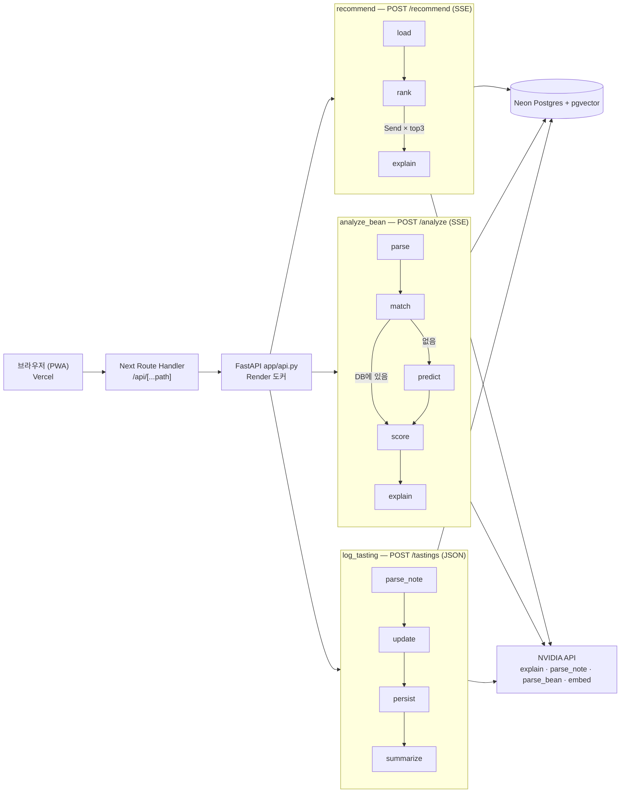

# 아키텍처

두 부분으로 나뉜다. **데이터 파이프라인**(`pipeline/`, 로컬에서 배치로 실행)이 공개 데이터를 모아 Postgres + pgvector 지식베이스를 만들고, **앱**(`app/` FastAPI + `web/` Next.js)이 그 지식베이스 위에서 추천·원두 분석·음용 기록을 처리한다. 두 부분은 DB 스키마(`db/schema.sql`)로만 연결된다.

## 1. 데이터 파이프라인

```mermaid
flowchart LR
    subgraph sources["소스 — collect/registry.py + roasters-kr"]
        cqi["CQI 2018·2023<br/>(MIT)"]
        kaggle["Kaggle coffeereview 스크랩 3종<br/>(비상업 포트폴리오 전용)"]
        roasterdb["RoasterDB 샘플<br/>(CC BY-NC 4.0)"]
        sca["SCA 플레이버 휠 JSON"]
        shopify["블루보틀 코리아<br/>Shopify products.json"]
        menus["프랜차이즈 공식 메뉴 7곳<br/>스타벅스·메가·빽다방·할리스·<br/>커피빈·폴바셋·컴포즈"]
        roasters["국내 로스터리 5곳<br/>(pipeline roasters-kr, 사실 정보만)"]
    end
    curated["data/curated/*.yaml<br/>브랜드 디카페인 정보·SCA 한국어<br/>(수기 정리)"]

    collect["collect<br/>robots.txt · 호스트별 1초 지연<br/>소스별 격리 · 날짜별 스냅샷"]
    normalize["normalize<br/>공통 스키마 · 산지/가공/로스팅 표기 통일<br/>디카페인 판별 · 메뉴 카페인 mg"]
    enrich["enrich<br/>규칙 우선 → 빈 칸만 LLM<br/>(qwen3.5:9b, JSON 스키마 검증)"]
    embed["embed<br/>nemotron-3-embed-1b<br/>2048 → 1024차원 (Matryoshka)"]
    load["load<br/>단일 트랜잭션 적재"]
    db[("Postgres 17 + pgvector<br/>coffees · reviews · menu_items ·<br/>brands · flavor_taxonomy<br/>HNSW 인덱스")]

    sources --> collect --> normalize --> enrich --> embed --> load --> db
    curated --> normalize
```

`uv run python -m pipeline run` = `pipeline/__main__.py`의 `STAGES = ["collect", "normalize", "enrich", "embed", "load"]`. `--only <stage>`로 한 단계만 돌릴 수 있고, enrich·embed는 캐시 덕분에 중단된 곳부터 이어서 돈다.



| 단계 | 코드 | 입력 → 출력 | 실패 처리 |
|---|---|---|---|
| collect | `pipeline/collect/` | 데이터셋·웹 → `data/raw/<날짜>/` 원본 | 소스 하나가 실패해도 나머지는 계속 |
| normalize | `pipeline/normalize/` | 원본 → 공통 스키마 레코드 | 스크랩 데이터 3종 병합, 소스 간 URL 중복 제거 |
| enrich | `pipeline/enrich.py`, `pipeline/rules.py` | 규칙으로 못 채운 산미·바디·단맛·태그만 LLM | 재개 가능한 캐시, 실패 행 `--retry-failed` |
| embed | `pipeline/embed.py` | 원두 문장 → 1024차원 벡터 | 모델별 텍스트 해시 캐시, 5xx·429 백오프 |
| load | `pipeline/load.py` | 레코드 → DB | 한 트랜잭션, 실패 시 롤백 |

임베딩 모델 교체 근거는 [ADR 0003](adr/0003-embedding-model.md). 전체 소스판과 오픈 라이선스판(`exclude_sources`로 coffeereview 제외)의 수치 비교는 [README](../README.md#결과-한눈에).

## 2. 요청 흐름

브라우저는 같은 출처의 `/api/*`만 부른다. Next.js Route Handler(`web/app/api/[...path]/route.ts`)가 쿠키와 SSE 스트림을 그대로 FastAPI로 중계하고, FastAPI(`app/api.py`)는 요청 종류에 따라 LangGraph 그래프 3개 중 하나를 실행한다(`graphs = {"recommend", "analyze", "log"}`).



노드 이름은 `app/graphs/*.py`의 `add_node` 이름 그대로이고, 자동 생성 다이어그램은 [graphs.md](graphs.md)에 있다.

| 노드 | 하는 일 |
|---|---|
| recommend `load` | 브랜드 메뉴·원두 후보(`Repo.brand_items`) |
| recommend `rank` | 하드 조건 필터(`passes`: 카페인·우유) → 취향 점수(`score_item`, 속성 0.6 + 향미 0.4) → MMR top3 → `cards` 이벤트 |
| recommend `explain` | 카드마다 `Send`로 병렬 실행. 코드가 사실을 문장 조각(맛 비교·맞는 점/아쉬운 점·맛 한 줄·추천 문구)으로 만들어 넘기고 LLM은 잇기만 한다 → 토큰 스트리밍 → 규칙 검사(방향·결론·필드명·문장 수), 어긋나거나 실패·12초 마감 초과 시 템플릿. 맞는 점이 없는 카드는 LLM 없이 코드가 쓴다 — [설계 결정 21](design-decisions.md#21-rag인데-왜-llm에게-검색-결과를-그대로-주지-않나) |
| analyze_bean `parse` | 규칙 파싱, 불확실하면 LLM(`parse_bean`) |
| analyze_bean `match` → `score` / `predict` | DB에 있으면 실측값, 없으면 이웃 10개(`Repo.neighbors`, 동점은 id로 고정 — [ADR 0006](adr/0006-deterministic-neighbors.md)) 가중 평균 + 신뢰도. 임베딩 실패 시 산지·가공 평균(신뢰도 낮음) |
| log_tasting `parse_note` → `update` → `persist` → `summarize` | 한 줄 후기 신호 추출 → 별점·신호로 프로필 갱신(학습률 1/(n+2)) → 저장 → "산미 −0.5" 같은 요약 |

### SSE 이벤트 순서 (`/recommend`, `/analyze`)

```text
event: cards            카드 전부(템플릿 설명 포함) — 화면이 먼저 뜬다      (recommend는 조건에 맞는 게 없으면 대신 event: empty)
event: explain_delta    카드별 설명 토큰 (key로 카드 구분, 카드 3개가 섞여 도착)
event: explain_done     카드 하나의 설명 완료                              (실패·마감 초과면 대신 event: explain_fallback + 템플릿)
event: error            그래프 예외 시에만 (트레이스백은 보내지 않음)
event: done             항상 마지막
```

`/tastings`는 스트리밍 없이 `{summary, changes, profile}` JSON을 돌려준다. 스트림이 끝날 때마다 `app/telemetry.py`가 JSON 한 줄(카드 수·첫 토큰 ms·폴백·에러)을 남기고 `scripts/ops/prod_stats.py`가 이를 집계한다([deploy.md](deploy.md)).

## 3. 배포

| 구성 | 위치 | 비고 |
|---|---|---|
| 웹 (전체판) | Vercel `sin1` — https://coffee-sommelier-psi.vercel.app | Next.js 16, PWA(서비스 워커는 `/api/*`를 캐시하지 않음) |
| 웹 (공모전 오픈 데이터판) | Vercel — https://coffee-sommelier-open.vercel.app | coffeereview 없는 DB에 연결 |
| API | Render 도커(singapore) — https://coffee-sommelier-api.onrender.com | 이미지 356 MB, 실행 메모리 약 75 MiB |
| DB | Neon Postgres 17 + pgvector (aws-ap-southeast-1) | |
| LLM·임베딩 | NVIDIA API 무료 엔드포인트 | 타임아웃 + 템플릿 폴백 |

절차는 [deploy.md](deploy.md).

## 범례

- 사각형 = 처리 단계 또는 그래프 노드(이름은 코드와 동일), 원통 = 데이터베이스, 묶음 상자 = 소스 목록 또는 LangGraph 그래프 하나.
- 실선 화살표 = 항상 가는 흐름, 라벨 달린 화살표 = 조건 분기(`add_conditional_edges`) 또는 `Send` 병렬 fan-out.
- "LLM"은 파이프라인에서는 로컬 Ollama(`qwen3.5:9b`), 앱에서는 NVIDIA API(`config/models.yaml`의 태스크별 설정)다.
