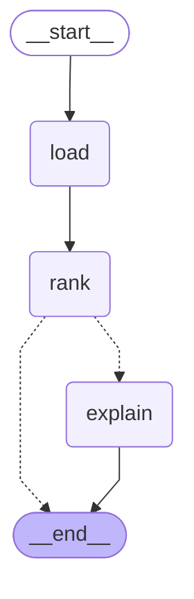
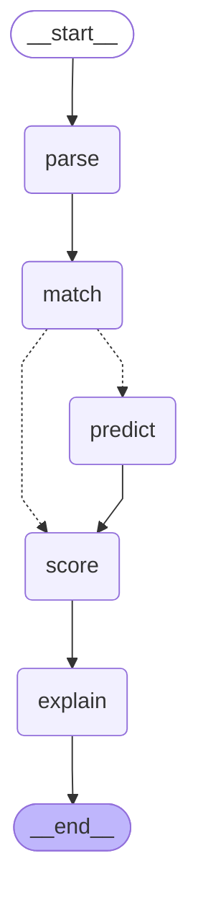
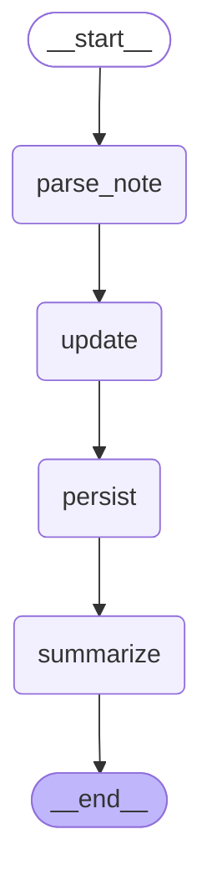

# LangGraph 그래프 (자동 생성: CompiledGraph.get_graph().draw_mermaid())

## recommend

```mermaid
---
config:
  flowchart:
    curve: linear
---
graph TD;
	__start__([<p>__start__</p>]):::first
	load(load)
	rank(rank)
	explain(explain)
	__end__([<p>__end__</p>]):::last
	__start__ --> load;
	load --> rank;
	rank -.-> __end__;
	rank -.-> explain;
	explain --> __end__;
	classDef default fill:#f2f0ff,line-height:1.2
	classDef first fill-opacity:0
	classDef last fill:#bfb6fc
```

## analyze_bean

```mermaid
---
config:
  flowchart:
    curve: linear
---
graph TD;
	__start__([<p>__start__</p>]):::first
	parse(parse)
	match(match)
	predict(predict)
	score(score)
	explain(explain)
	__end__([<p>__end__</p>]):::last
	__start__ --> parse;
	match -.-> predict;
	match -.-> score;
	parse --> match;
	predict --> score;
	score --> explain;
	explain --> __end__;
	classDef default fill:#f2f0ff,line-height:1.2
	classDef first fill-opacity:0
	classDef last fill:#bfb6fc
```

## log_tasting

```mermaid
---
config:
  flowchart:
    curve: linear
---
graph TD;
	__start__([<p>__start__</p>]):::first
	parse_note(parse_note)
	update(update)
	persist(persist)
	summarize(summarize)
	__end__([<p>__end__</p>]):::last
	__start__ --> parse_note;
	parse_note --> update;
	persist --> summarize;
	update --> persist;
	summarize --> __end__;
	classDef default fill:#f2f0ff,line-height:1.2
	classDef first fill-opacity:0
	classDef last fill:#bfb6fc
```

